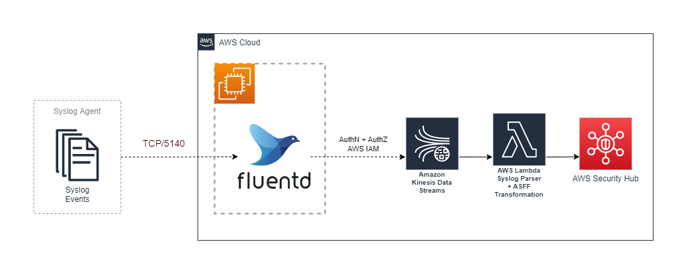

# Welcome to Streaming Syslog to AWS Security Hub sample project!

## Overview

This project has an [associated blog](https://aws.amazon.com/blogs/) which provides greater detail regarding this solution.

## Solution Overview

### Architecture

## Getting Started

### Pre-Requisites

In order to get started, you will need an AWS account, preferably free from any production workloads. Also, either an IAM role to deploy with from Cloud9 or an IAM user with admin permissions as the stacks we will be deploying require significant access.
Once we have that in place, it’s time to get ready to deploy.

### Cloud9
[AWS Cloud9](https://aws.amazon.com/cloud9/) is a cloud-based integrated development environment (IDE) that lets you write, run, and debug your code with just a browser. Cloud9 comes pre-configured with many of the dependencies we require for this blog post, such as git, npm, and AWS CDK.

Create a Cloud9 environment from the AWS console. Provide the required Name, and leave the remaining default values. Once your Cloud9 environment has been created, you should have access to a terminal window.

### Build and Deploy

From a terminal window, you will need to clone the GitHub repo, install packages, build, and deploy the CloudFormation templates. Issue the following commands in a terminal window in Cloud9. By default, the AWS CDK will prompt you to deploy changes. If you want to skip confirmations, add the following command line option to the AWS CDK commands below.  <code>--require-approval never</code>.

#### Clone GitHub repo
<pre><code>
git clone https://github.com/aws-samples/streaming-syslog-to-aws-security-hub-sample
cd streaming-syslog-to-aws-security-hub-sample
</code></pre>

#### Bootstrap AWS Cloud Development Kit (AWS CDK v2)
<pre><code>
cdk bootstrap
</code></pre>

#### Install packages
<pre><code>
npm install
</code></pre>

#### Install Lambda Function packages
<pre><code>
cd src/lambda-syslog
npm install
cd ../..
</code></pre>

#### Build
<pre><code>
npm run build
</code></pre>

#### Deploy stack
<pre><code>
cdk deploy
</code></pre>

## License Summary

This library is licensed under the MIT-0 License. See the [LICENSE](./LICENSE) file.